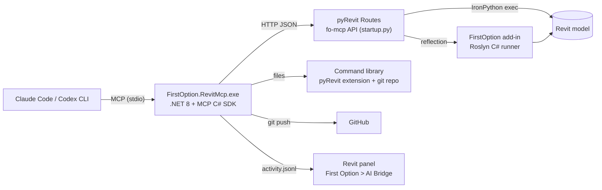

# FirstOption Revit MCP

Claude Code and Codex CLI work in a live Revit model. The agent runs IronPython or C# inside Revit through pyRevit Routes, saves the code that works in a command library, and uploads the library to GitHub. A Revit panel on the **First Option** ribbon tab shows what happens.



## What is in this folder

| Folder | What it is |
|---|---|
| `src/Server` | The MCP server (`FirstOption.RevitMcp.exe`), .NET 8, [MCP C# SDK](https://github.com/modelcontextprotocol/csharp-sdk) 2.2.0, stdio |
| `src/Addin` | The Revit add-in: ribbon tab "First Option", dockable MCP panel, GitHub Settings window, Roslyn C# runner. Revit 2021-2026 |
| `src/Shared` | Settings, paths and the activity log, shared by the server and the add-in |
| `pyrevit/FirstOptionMCP.extension` | The bridge: `startup.py` registers the pyRevit Routes API `fo-mcp` |
| `skills` | Agent skills for Claude Code and Codex (same `SKILL.md` format) |
| `scripts/install.ps1` | Builds and installs everything |
| `docs/REQUIRED-APPS.md` | The applications you need and how to install them |
| `mockups` | The Codex CLI prompt and script for the UI mockups |
| `tests` | Mock Routes server, MCP smoke test, C# runner test |

## 1. Install the applications

See [docs/REQUIRED-APPS.md](docs/REQUIRED-APPS.md): Revit, pyRevit (+ CLI), .NET 8 SDK, Git, Node.js, Claude Code, Codex CLI, GitHub CLI (optional).

## 2. Build and install

Close Revit. Then, in PowerShell, in this folder:

```powershell
powershell -ExecutionPolicy Bypass -File scripts\install.ps1 -RegisterClaude -RegisterCodex
```

The script does these steps (use `-DryRun` to see them first, `-RevitVersions 2025,2026` to limit the versions):

1. Publishes the MCP server to `%LOCALAPPDATA%\FirstOption\RevitMCP\server\FirstOption.RevitMcp.exe`.
2. Builds the add-in for each installed Revit and copies it to `%APPDATA%\Autodesk\Revit\Addins\<version>\`.
3. Adds `pyrevit\` and the command library to the pyRevit extension paths, and turns on pyRevit Routes.
4. Copies the skills to `~\.claude\skills` and `~\.codex\skills`.
5. Registers the MCP server in Claude Code and Codex.

## 3. Register the MCP server by hand (when you did not use -RegisterClaude / -RegisterCodex)

### Claude Code

```powershell
claude mcp add --scope user firstoption-revit -- "$env:LOCALAPPDATA\FirstOption\RevitMCP\server\FirstOption.RevitMcp.exe"
claude mcp list
```

For one project only, use `--scope project`. Claude Code then writes `.mcp.json` in that project.

### Codex CLI

```powershell
codex mcp add firstoption-revit -- "$env:LOCALAPPDATA\FirstOption\RevitMCP\server\FirstOption.RevitMcp.exe"
codex mcp list
```

Revit work can take longer than the Codex default tool timeout. Add the timeouts in `~\.codex\config.toml`:

```toml
[mcp_servers.firstoption-revit]
command = 'C:\Users\<you>\AppData\Local\FirstOption\RevitMCP\server\FirstOption.RevitMcp.exe'
startup_timeout_sec = 20
tool_timeout_sec = 300
```

### Check

```powershell
& "$env:LOCALAPPDATA\FirstOption\RevitMCP\server\FirstOption.RevitMcp.exe" doctor
```

## 4. pyRevit setup (the script does this when the `pyrevit` CLI is on PATH)

```powershell
pyrevit extensions paths add "<this folder>\pyrevit"
pyrevit extensions paths add "$env:USERPROFILE\Documents\FirstOption\RevitCommandLibrary"
pyrevit configs routes enable
```

Then start Revit, or click pyRevit > Reload. Windows Firewall can ask about Revit the first time Routes starts; allow it.

## 5. Skills

| Skill | Use |
|---|---|
| `revit-mcp` | The main loop: find Revit, search the library, run, fix, save. Rules and errors. |
| `pyrevit-engines` | pyRevit runs IronPython, CPython 3, C# and VB.NET. When to use C#, how to translate C# samples. |
| `revit-command-library` | Search before writing; how to save a command so other agents can use it. |
| `revit-families-and-3d` | DirectShape, family documents, load and place instances. |
| `revit-github-sync` | Push the library to GitHub. |

Copy them by hand:

```powershell
Copy-Item skills\* "$HOME\.claude\skills" -Recurse -Force
Copy-Item skills\* "$HOME\.codex\skills" -Recurse -Force
```

## 6. Use it

1. Start Revit and open a model.
2. Click **First Option > AI Bridge > MCP Panel**. The panel must show **pyRevit Routes online** and a port.
3. In Claude Code or Codex, ask for Revit work, for example:
   - "List the levels and the number of walls on each level."
   - "Create a 5 x 4 grid of structural columns, 6 m spacing, on Level 1. Save it as a command."
   - "Build a generic model family: a 1000 x 500 x 800 mm box with a Width parameter. Load it and place one at 0,0,0."
   - "Push the new commands to GitHub."

## MCP tools

| Tool | What it does |
|---|---|
| `revit_instances` | Lists the Revit sessions that answer (port, version, document, pyRevit, Python engine, C# runner) |
| `revit_status` | One session, plus the languages you can use, the library folder and the GitHub state |
| `revit_execute_python` | Runs Python in Revit (`doc`, `uidoc`, `uiapp`, `app`, `DB`, `UI`, `args`; `result`), inside one transaction by default |
| `revit_execute_csharp` | Compiles and runs a C# method body in Revit with Roslyn (`uiapp`, `uidoc`, `doc`, `app`, `args`, `Console`) |
| `library_search` | Searches saved commands |
| `library_get` | Reads a command's metadata and code |
| `library_save` | Saves working code as a command (pyRevit button + metadata); auto-pushes when that is on |
| `library_run` | Runs a saved IronPython or C# command with `args_json` |
| `library_info` | Library folder, command count, how to show the buttons |
| `github_status` | GitHub settings and local git state |
| `github_push` | Commits and pushes the library; the Revit panel shows a notice |

## Languages

pyRevit can run IronPython, CPython 3, C# and VB.NET scripts. Through this MCP:

| Language | Live run | Saved as |
|---|---|---|
| IronPython | `revit_execute_python` (the engine that loads `startup.py`) | `script.py` + `body.py` |
| C# | `revit_execute_csharp` (needs the add-in) | `script.cs` (pyRevit `IExternalCommand` wrapper) + `body.cs` |
| CPython 3 | No | `script.py` with `#! python3` + `body.py` |

## The command library

Default folder: `%USERPROFILE%\Documents\FirstOption\RevitCommandLibrary` (change it in GitHub Settings).

```
RevitCommandLibrary/
  README.md                          table of commands (written by the MCP)
  index.json                         the same, for agents
  FirstOptionLibrary.extension/
    FO Library.tab/
      Commands.panel/
        create_wall_grid.pushbutton/
          command.json               description, inputs, tags, runs, tested Revit versions
          body.py                    the code as it ran through the MCP
          script.py                  pyRevit button wrapper (transaction + same names as the MCP)
          bundle.yaml                button title and tooltip
```

## The Revit panel

**First Option > AI Bridge** has three buttons:

- **MCP Panel**: shows or hides the dockable panel. It shows the pyRevit Routes state, the port of this Revit, the Revit, pyRevit and Python versions, the C# runner state, the last agent call, the executed commands (select one to see its code and output), and a notice when the MCP uploads to GitHub.
- **Command Library**: opens the library folder.
- **GitHub Settings**: repository owner, name, branch, token (encrypted with Windows DPAPI for the current user), library folder, commit author, auto-push, and push notices. **Test connection** checks the repository and the push permission.

## Files on this computer

| File | Written by |
|---|---|
| `%LOCALAPPDATA%\FirstOption\RevitMCP\settings.json` | GitHub Settings window (the MCP reads it on each call) |
| `%LOCALAPPDATA%\FirstOption\RevitMCP\activity.jsonl` | MCP server (the panel reads it) |
| `%LOCALAPPDATA%\FirstOption\RevitMCP\server\` | `install.ps1` |

Advanced settings in `settings.json`: `routesHost` (default `127.0.0.1`), `portStart` (48884), `portCount` (10), `remoteUrl` (a git remote that is not github.com).

## Troubleshooting

| Problem | Fix |
|---|---|
| Panel: "pyRevit Routes offline" | pyRevit > Settings > Routes: turn on the server, Save, Reload. Check `pyrevit extensions paths` lists `pyrevit\`. |
| Panel: bridge answers for another Revit | Reload pyRevit in this Revit. |
| Tool: "The C# runner is not loaded" | Install the add-in for this Revit version (`install.ps1 -RevitVersions 2026`) and restart Revit. |
| Tool times out | A dialog is open in Revit, or Revit is busy. Close the dialog. |
| Routes on a different host | Set `routesHost` in `settings.json` to the host in pyRevit Settings > Routes. |
| `git push failed` | Check the token and the repository in GitHub Settings; use Test connection. |
| Library buttons do not show | `pyrevit extensions paths add "<library folder>"`, then Reload. The tab is "FO Library". |

## Development

```powershell
dotnet build src\Server -c Release
dotnet build src\Addin -c Release -p:RevitVersion=2026   # 2025-2026: net8.0-windows, 2021-2024: net48
python tests\smoke_mcp.py                                # MCP end to end, against a mock Routes server
dotnet run --project tests\RunnerCompileTest -c Release  # Roslyn runner, outside Revit
```

Regenerate the UI mockups with Codex CLI:

```powershell
powershell -ExecutionPolicy Bypass -File mockups\generate-mockups.ps1
```
